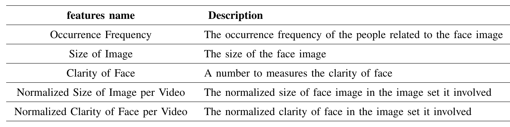

## Basic Description
To our best knowledge, IF-Dataset is the first dataset of irrelevant faces recognition in Chinese short-form video. 
IF-Datast includes 43965 images of irrelevant faces and 89924 images of relevant faces, with 133889 face images in total. 
ID-Dataset contains the face image as well as five statistical features of each face. The statistical features are described as follows:  

## Structure of the test directory
IF-Dataset 
-->video0_dir(dir)  
------>0(dir) 
---------->img0(file) 
---------->img1(file) 
---------->img2(file) 
------>1(dir)  
------>2(dir)  
-->video1_dir(dir) 
-->video2_dir(dir) 
## How to use
Firstly, download dataset.zip form Baidu Cloud.  
URL: https://pan.baidu.com/s/1CCUryYf5pD1twUKHdhNNXw 
Code: 2g2q

Then, decompress the dataset.zip and move the IF_train.csv and IF_test files into the dataset directory. The directory structure is supposed to be like this:

dataset(dir) 
-->IF_Dataset(dir) 
-->IF_train.csv(file) 
-->IF_test.csv(file) 

Finally, you can use the IF-Dataset by accessing the structure.csv.