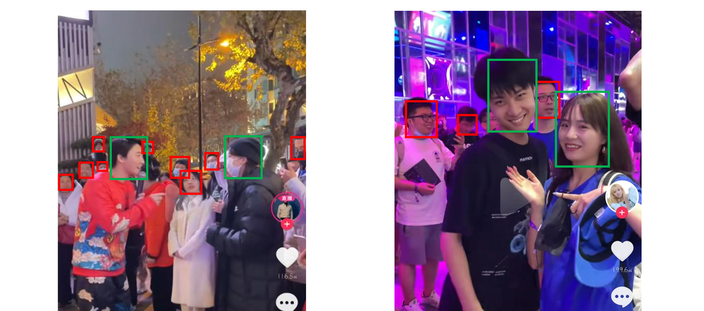

# IF-Dataset
IF-Dataset refers to "Irrelevant Face Dataset".

This is the dataset used in the paper <a  href ="https://www.sciencedirect.com/science/article/abs/pii/S0925231222008013">Recognizing irrelevant faces in short-form videos based on feature fusion and active learning</a>

The codes for the MMFNet is available at <a href="https://github.com/JasonZuu/MMFNet-2022"> MMFNet-2022 </a>

## Basic Information
To our best knowledge, IF-Dataset is the first dataset for irrelevant faces recognition in Chinese short-form video, which includes 43965 images of irrelevant faces and 89924 images of relevant faces, with 133889 face images in total. 

### Description of features
IF-Dataset contains the face image as well as five statistical features of each face. The statistical features are described as follows:  

### Description of files
IF_train.csv: Containing features and image access of the IF-Dataset's training set. 
IF_test.csv: Containing features and image access of the IF-Dataset's testing set. 
active100.csv: Containing data used for active learning. 
tiktok.csv: Containing data used for evaluating the generalization performance of the model. 

### Structure of the project
dataset 
-->IF-Dataset 
---->video0_dir(dir)  
------>0(dir) 
--------->img0(file) 
--------->img1(file) 
--------->img2(file) 
------>1(dir)  
------>2(dir)  
---->video1_dir(dir) 
-->tiktok(dir) 
-->active_100(dir) 

## Samples of data
### Relevant faces and irrelevant faces
  
In the above frames, relevant faces are those surrounded by green boxes while irrelevant faces are those surrounded by red boxes.  

In the IF-Dataset, faces are extracted from those frames of short-form videos and labeled according to our rules.

### Samples
+ Samples of relevant faces

+ Samples of irrelevant faces

Note that all samples are resized to the [224, 224] in order to output visual results. As most of the irrelevant samples are smaller than this shape, their visual results are lower in quality than the relevant.

## How to use
### Access to data
IF-Dataset can be downloaded from the Baidu Cloud and the Google Could.

Download from Baidu Cloud:  
URL: https://pan.baidu.com/s/19lwR19v2cafyTsVu2wTPmg     
Password: i4in  

Download from Google Cloud:  
https://drive.google.com/file/d/14MjWdUUc79jyD_iRVQV5RMkDpZbLVfMF/view?usp=sharing

### Guidences for use
1. Download the dataset.zip file.
2. Decompress the dataset.zip and move the dataset directory into this project. Make surethe directory structure looks like this:
dataset(dir) 
-->IF_Dataset(dir) 
-->active_100(dir) 
-->tiktok(dir) 
IF_train.csv(file) 
IF_test.csv(file) 
tiktok.csv(file) 
active100.csv(file) 

3. Use the IF-Dataset through reading csv files.
